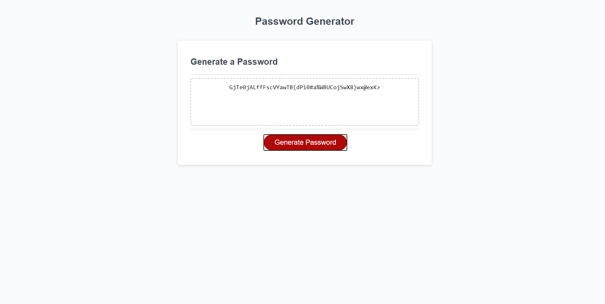

# JavaScript: Password Generator

## Live Link
https://haydenabeck.github.io/random-password-generator/

## Contributors 
@haydenabeck
with assistance from my TA, Paul and my tutor Sammantha

## Description

I was required to modify starter code to create an application that enables employees to generate random passwords based on criteria that they’ve selected. The criteria for password selection was based of the user being able to select which characters to include (lowercase, uppercase, numeric, or special). Each one of these parameters prompts the user to make a selection before moving on. I started this project with a loose framework of code that was provided.

The first step in my process for figuring out how to navigate this idea was defining my variables which I did here:

`var lowerBank = ['a', 'b', 'c', 'd', 'e', 'f', 'g', 'h', 'i', 'j', 'k', 'l', 'm', 'n', 'o', 'p', 'q', 'r', 's', 't', 'u', 'v', 'w', 'x', 'y', 'z'];`
      `var upperBank = ['A', 'B', 'C', 'D', 'E', 'F', 'G', 'H', 'I', 'J', 'K', 'L', 'M', 'N', 'O', 'P', 'Q', 'R', 'S', 'T', 'U', 'V', 'W', 'X', 'Y', 'Z'];`
     ` var specialBank = ['!','@','#','$','%','^', '&', '*', '(', ')', '{', '}', '+', '=', '<', '>', '/'];`
      `var numericBank = ['1', '2', '3', '4', '5', '6', '7', '8', '9', '0'];`
      `var avaiableBank = []; // ['a', 'b', 'c', 'A', 'B', 'C']`

My greatest point of struggle in this whole process was this portion of the code here:

`if (lowercase) {
        // The foreach is cycling through my lowerbank array individually and putting all of these into my available bank variable
        lowerBank.forEach(function(character) {
          avaiableBank.push(character);
        })
      }`

I ended up using a series of if statements in order to cycle through my defined variable arrays which then assigns them to my available bank. My available bank is what is then accessed in order to generate the password. Paul was a big help in explaining this section to me, so thank you Paul <3 My javascript is heavily commented with how exactly I worked through the remaining processes, but I thought it would be helpful to include these specific points for later reference as I struggled with these concepts specifically.

## Technology Stack 
HTML, CSS, Javascript

## Usage
 A user can click a button and create a password populated by randomly generated characters of which the user can select their specific type (lowercase, uppercase, numeric, or special characters).

## Screenshots

## Contact 
#### Name (@haydenabeck)
* Email: [haydenabeck@gmail.com](haydenabeck@gmail.com)
* LinkedIn: https://www.linkedin.com/in/hayden-beck-17109419a/

